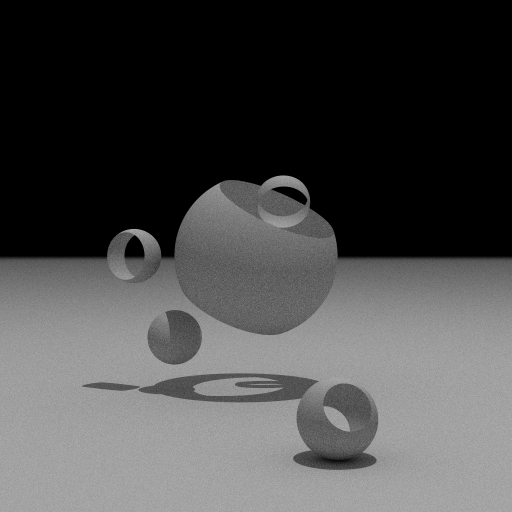
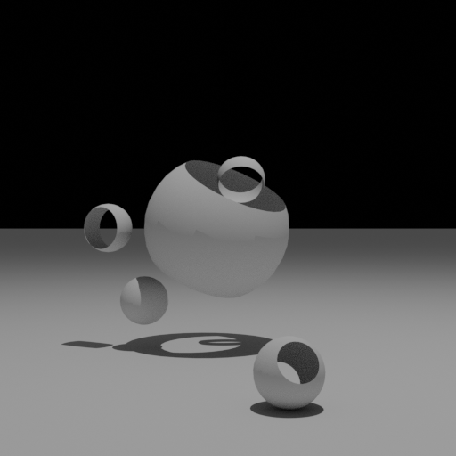
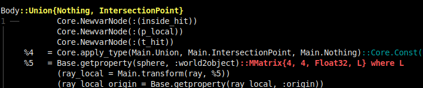
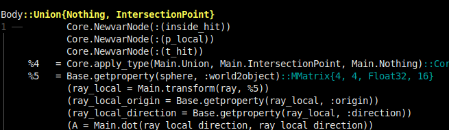
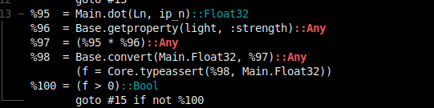
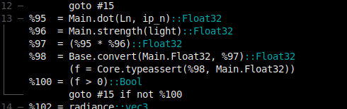
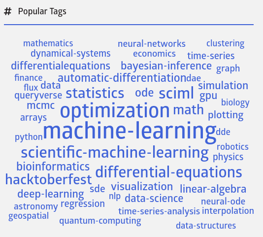

# The snake and the serpent - a journey of two languages

Note: this was written in March 2021 using Julia 1.6RC1, some things will have changed in the Julia ecosystem since then.

I'm a fairly novice user when it comes to Julia, only starting to dabble in it the summer of 2020. My day-to-day chosen languages for development are mostly Python and sometimes a bit of C++ for when things really need high performance. But whenever I can get away with using Python I prefer it, as it allows higher-level and cleaner code (yes, this is debatable ;-)), with lots of useful packages you can take advantage of.

Being a 3D graphics fan I have made number of toy implementations of 3D renderers over the years, mostly ray-tracers. One such toy, written in 2016 and dubbed SAHARA, was a path tracer. The latter is a fancy word for an algorithmic technique that is capable of simulating realistic lighting in a 3D scene. Path tracing is pretty much the de-facto rendering method for realistic images these days. An example of a path traced image is shown below.



This is by no means an exciting scene when it comes to path tracing, but SAHARA was written in less than 1,000 lines of *Python*, using a matrix/vector library also in pure Python (as NumPy has quite some overhead for the small matrices and vectors involved). That's not a lot of code, plus it was high-level and fairly straightforward. It was also started mostly as a half-serious test to see what kind of performance Python could provide in this case anyway.

The lack of performance is also where SAHARA got its name: *Slow As Hell At Rendering Anything*. The above image of 512x512 pixels used 256 paths per pixel and had only a few objects (with the simplest of materials) and 2 light sources in the scene. It took 44 *minutes* to compute. It traced roughly 183 million rays, for an average of around 69,000 paths per second (which by path tracing standards is really slow). And this was even using Python's `multiprocessing` module to compute in parallel using 4 Python processes on an Intel Core i5-4460 @ 3.20 GHz. 

One method to speed up Python programs is to use PyPy, an alternative implementation of the Python language that leverages JIT compilation. Running this render under PyPy massively improved performance, to 2 minutes and 42 seconds for the same render, more than 16x faster. This really shows the value of PyPy, and JIT compilers versus interpreters (such as CPython) in general.

All in all this was a fun experiment in 2016, but it was obvious that even when using PyPy the render time for such a simple scene was really long. So I didn't spend any more time extending the SAHARA code to include features that the [really](https://www.cycles-renderer.org/) [cool](https://www.arnoldrenderer.com/) [renderers](https://www.disneyanimation.com/technology/hyperion/) have. 

After I recently had started to play around with Julia I re-discovered the Python code described above and I thought it would be fun to port it to Julia. This would provide both a nice learning experience and could give some insight into Julia's performance compared to Python. 

As a side-note: just to compare and get some idea of speed of the Python code I recreated the scene recently in [Blender](https://www.blender.org), which by the way is almost impossible to do exactly (polygons versus sphere primitives, different lighting model, different rendering implementation, BVH versus linear array, etc). Rendering the image below in Blender 2.92 with Cycles (CPU) and render settings matched as best as possible took 10.96 seconds (or 40.40 seconds when using only a single core), which is still almost 15x faster than the Python code under PyPy. 



It turned out that porting the Python code to Julia was fairly straightforward, initially. They're both high-level languages with similar constructs and data types. For example, a class and its method in the Python code could be translated into Julia `struct` plus a similar set of methods (only basic OO constructs were used in the Python code anyway). Where I had used custom classes for 4x4 matrices and vectors in the Python code I initially used the built-in `Matrix` and `Vector` types in Julia, but see below for more details on where it went from this starting point.

## Threading issues (part 1)

Doing a test run of the initial single-threaded version of the Julia code I was surprised to notice that 4 CPU cores in my system were used. How could that be, as I was not doing any multi-threaded operations? It must be something in Julia itself. After some confused digging around and disabling various parts of the code it [turned out](https://discourse.julialang.org/t/operations-on-small-matrices-and-blas-in-1-6-0-rc1/56344) that this was caused by the BLAS library used by Julia that implements operations on matrices. 
Using `BLAS.set_num_threads(1)` at the start of the code not only made it work single-threaded as expected, but also improved the rendering time by 50%. Actually, it's a bit unfair as normally multi-threaded BLAS operations make a lot of sense for large matrices, but just not for the 4x4 size used in the rendering here. Plus, the Julia manual [clearly mentions](https://docs.julialang.org/en/v1/stdlib/LinearAlgebra/#BLAS-functions) the use of BLAS for matrix operations.

The forum thread linked above also gave the tip to use the data types from the [StaticArrays](https://github.com/JuliaArrays/StaticArrays.jl) package, as they are much more efficient for small matrices and vectors, due to getting allocated on the stack in most cases. The package was something which I knew about but for some reason did not think of to apply in the code, but this was fairly easy to change. 

All in all, I ended up with 912 lines of Julia, versus 946 for Python, amazingly close. Of course, a one-to-one translation is impossible, but the Julia implementation didn't do anything radically different when it came to the central path tracing algorithm.

Testing the Julia *single-threaded* implementation under Julia 1.6 RC1 on the same scene as above took 1 minute and 43 seconds and happily produced similar output as the Python version:


So the rendering was already around 1.6x faster than the Python implementation under PyPy and I hadn't even applied multi-threading yet. Plus, I'm still starting out in in Julia so there must be some room for improvment. Great! 

But it also somehow felt a bit disappointing as it was still a factor of 2.5x slower than the Cycles rendering in Blender (which is written in C++). Wasn't Julia supposed to provide high performance, similar to C/C++? Were there really enough knobs I could turn, tweaks to be made to the implementation to get higher performance? 

It turns out the answer was a clear "yes!"

## Keeping it stable

One of the [Performance Tips](https://docs.julialang.org/en/v1/manual/performance-tips/) in the Julia manual is to make sure you [write "type-stable" functions](https://docs.julialang.org/en/v1/manual/performance-tips/#Write-%22type-stable%22-functions). This basically means not storing values of different types in a variable, or making sure a function does not return different types (it's more complex than that, but is a good enough description for here). Julia provides the very useful `@code_warntype` macro that you can apply to a single function call and which will show you the inferred types for local variables and the function return type. This is the information that the Julia compiler uses to generate code, so any issues at this level will have an impact on performance.

Digging into the code one type-instability was loudly reported in red in the ray-sphere intersection code (which is executed millions of times during a render):



What this says is that the `world2object` field of `sphere` (which holds a matrix transform) was of a non-concrete type. This was a bit of a cryptic signal, as the `MMatrix` type referenced was one of the types from StaticArrays package I had just changed the code to use, in order to optimize it. I was also specifying the matrix dimension (4x4) and element type (`Float32`), but what was this `L` parameter? In the code I had defined a type-alias `mat4` as a shortcut for the full `MMatrix` type, which was used in the sphere type definition:

```
const mat4 = MMatrix{4,4,Float32}

struct Sphere <: Primitive
    radius::Float32
    zmin::Float32
    zmax::Float32
    object2world::mat4
    world2object::mat4
end
```

Looking at the docs for `MMatrix` (using `?MMatrix` in the Julia REPL prompt) it clearly specifies the type has 4 parameters:

```
  MMatrix{S1, S2, T, L}(undef)
  MMatrix{S1, S2, T, L}(x::NTuple{L, T})
  MMatrix{S1, S2, T, L}(x1, x2, x3, ...)
```

Notice how only 3 of the type parameters of `MMatrix` are specified in my `mat4` definition above, i.e. no `L`? But the documentation for `MMatrix` also reads:

> The L parameter is the length of the array and is always equal to S1 * S2. Constructors may drop the L, T and even S2 parameters if they are inferrable from the input (e.g. L is always inferrable from S1 and S2)

So that would mean that L should be inferable from S1 and S2 (both 4) here, right? Wrong, as that applies only to constructors, as noted. For example, constructing a value specifying only the 2x2 dimension indeed deduces L to be 4:

```
julia> m = MMatrix{2,2}([6 7 ; 8 9])
2×2 MMatrix{2, 2, Int64, 4} with indices SOneTo(2)×SOneTo(2):
 6  7
 8  9
```

But when a struct field has a type `MMatrix{4,4,Float32}`, as `world2object` did above, then the type is actually under-specified as L is not known during type inference and the compiler has no choice but to make fewer assumptions on the value type and as a result generates less efficient code.

So a quick fix was to specify the matrix size as well:

```
const mat4 = MMatrix{4,4,Float32,16}
```

Checking the output of `@code_warntype` it was now happy:



A very nice surprise was that this little change resulted in a rendering speedup of a factor TWO... 

One lesson for me here was to pay real careful attention to these kinds of type-instabilities and to try to better understand what is going on. Code that might seem reasonable can actually have unintended side-effects, as the Julia type system is quite sophisticated and there can be subtle interactions with the compiler.

## Oh Memory, Where Art Thou?

Another performance tip in the Julia manual is to [pay attention to memory allocation](https://docs.julialang.org/en/v1/manual/performance-tips/#Measure-performance-with-[@time](@ref)-and-pay-attention-to-memory-allocation), which can be inspected in a number of different ways. For example, the `@btime` macro from the [BenchmarkTools](https://github.com/JuliaCI/BenchmarkTools.jl) package will report the number of allocations and total size allocated. On a render of 512x512 pixels and 16 rays per pixel this resulted in:

```
  6.742 s (158412412 allocations: 6.64 GiB)
```

After the `mat4` change above this reduced to

```
  3.247 s (16869402 allocations: 414.40 MiB)
```

This provides part of the explanation why the code was sped up so much: memory allocated went down by a factor of more than 16x (and number of allocations by more than 9x)!

But there were still almost 17 million allocations left. As said above the allocation numbers above where for a render of 512x512 pixels at 16 samples per pixel, so around 4.2 million primary rays. This implies on average 100 bytes were allocated for each primary ray traced. That still seemed like a lot of unnecessary memory allocations.

One way to get insight into the actual places where allocations are made is to run the code using the option `--track-allocation=user`. This will produce annotated source files that list the bytes of memory allocated per line (at the expense of an N-fold slowdown for such a tracking run). Inspecting the rendering code in this way one particular statement jumped out:

```
        0     for light::Light in lights
                  ...
        -         # XXX apparently this allocates?
238215296         f::Float32 = dot(Ln, ip_n) * light.strength
        0         if f > 0
        0             radiance += vec3(f, f, f)
        -         end
                  ...
```

How could a simple dot-product of two 3-vectors multiplied by a float (the light strength) end up allocating 238 MB? Again, `@code_warntype` came to the rescue to explain:



As can be seen from the the `%96 = ...` line the result of getting property `strength` of `light` (i.e. `light.strength`) is inferred to be of type `Any`. This is the worst possible outcome as it tells the compiler absolutely nothing about the type of value, so it cannot assume or optimize anything. This in turn leads to extra allocations due to boxing, extra type-checks at runtime, etc. Also note that the two lines using the value of type `Any` below it subsequently *also* end up being inferred to be of type `Any`. So an occurrence of a value of type `Any` can have further negative consequences downstream.

And this is were my usual object-oriented way of writing code, especially for a statically-typed language like C++, showed itself to be unsuitable for Julia. What is fairly standard in C++ code, and to a lesser extent Python, is to have an abstract superclass for a certain group of "things", with concrete subclasses for each specific thing. Shared fields are then placed in the superclass and will be available as fields in each subclass.

To make it more concrete (pun intended) the value `light` above in the Julia code was of type `Light`, which I defined as an abstract type, with 2 concrete subtypes:

```
abstract type Light end

struct PointLight <: Light
    position::vec3
    strength::Float32
end

# Hemisphere covering positive Z-axis, centered at origin
struct HemisphericalLight <: Light
    radius::Float32
    strength::Float32
end
```

In C++ I would have placed the `strength` field in the `Light` supertype (all lights have a strength), but in Julia *abstract types cannot contain fields*. But unfortunately concrete types, which *can* contain fields, can not have subtypes. These typing restrictions are really hard to swallow at first when you're used to OOP, by the way, they feel unnecessarily strict (but are apparently for optimization reasons).

Anyways, during porting from Python I did the next best thing, which is to give both concrete light types a `strength` field. This field should therefore always be available when accessing `light.strength` as long as `light` is an instance of `PointLight` or `HemisphericalLight`. But the variable `light` in the loop above is of type `Light`, which is abstract (and thus contains no fields). So the Julia compiler can not assume it has a field `strength` and therefore also doesn't know its type. Hence the type of `light.strength` is reluctantly assumed to be `Any`.

Note that this is fundamentally different than, say, in C++ when using classes similar to the above Julia constructs:

```
struct Light { float strength; };

struct PointLight : public Light { vec3 position; };

struct HemisphericalLight : public Light { float radius; }
```

By placing `strength` in the superclass `Light` guarantees that whenever the C++ compiler sees a value of type `Light` or one of its subclasses it knows the `strength` field is available. Furthermore, it knows where in memory the field is located and can directly access it based on the address of the object. In contrast, Julia can only access the field in a similar way when it has a value of a concrete type, e.g. `PointLight`.

To get back to the allocation issue above we can fix this by not accessing the `strength` field directly but by using helper functions for each concrete type:

```
strength(p::PointLight) = p.strength
strength(h::HemisphericalLight) = h.strength
```

Instead of using `light.strength` we then call

```
strength(light)
```

This might actually seem worse, as we now have to make a function call instead of just accessing the struct field. And actually when thinking about it some more it is even *worse* than that: at run-time the concrete type of `light` needs to be checked to see which of the two `strength()` functions to actually call. However, the latter - dispatching on the run-time type - is something that is really optimized in Julia (just like in C++). Plus, a simple function that merely accesses a single field can usually be *inlined*, in effect inserting the code of the function at the place where it would be called (also just like in C++).

Making the above changes resulted in the type-instability disappearing:



Note that the result of the `strength` call is now inferred to always be `Float32`, even though we did not specify explicit return types on the two functions above.
Checking the annotated sources confirmed memory was no longer being allocated:

```
        0         f::Float32 = dot(Ln, ip_n) * strength(light) 
        0         if f > 0
        0             radiance += vec3(f, f, f)
        -         end
```


Checking the rendering time with these changes:

```
  2.155 s (1980861 allocations: 187.18 MiB)
```

So the total render time was further reduced (was 3.247s) by a factor 1.5x , the number of allocations (was 16.8M) reduced by 8.5x and total memory allocated (was 414 MiB) reduced by 2.2x. Not bad for some minor changes to the code!

After fixing a few more of these types of issues the single-threaded render time on 512x512 pixels at 16 samples per pixel had almost no memory allocations remaining, with a slight further decrease in run time:

```
  2.086 s (3459 allocations: 6.24 MiB)
```

Some allocations will remain as these are hard to get rid of, for example the array needed to hold the output image. But that's no issue as it is allocated only once at the beginning of the program and keeps a fixed size.

## Threading issues (part 2)

Path tracing, and ray tracing in general, is a so-called "embarrassingly parallel" problem. You can subdivide the image to render into independent parts, say blocks of 32x32 pixels, and have multiple compute threads each work on a set of parts in parallel, without any of the threads needing to interact with each other. When finished simply combine all the rendered parts to get the final output image.

But adding multi-threading turned out to be less straightforward in Julia compared to either C++ or Python, as the Julia approach to multi-threading (or parallel processing in general) aims to be more user-friendly and composable. The latter means that when you would use multiple Julia packages that take advantage of parallel processing together they should play nice with each other instead of fighting over processing power and/or interfering with each other. 

To make this feasible Julia provides parallel processing through a task-based framework that is built on top of OS-level threading. In contrast to many languages no low-level Julia interface to the underlying OS threading API, such as Pthreads on Linux, is (easily) available. Instead of manually starting OS-level threads a user schedules tasks and Julia tries to optimize their execution using the available OS-level threads. 
By writing code in terms of tasks instead of threads allows packages to work together more easily, while allowing the Julia runtime to optimize the overall execution of all tasks that need to run.

One of the interesting aspects here is that you need to start Julia with `-t <n>` to specify the number of available OS threads within Julia, instead of that number being derived from (say) the available number of CPU cores. And by default `n` is 1, so multi-threading is disabled unless requested.

Using the task-based framework, below is the code that kicks off the parallel rendering of each image part (called a bucket). The pixels in each bucket are rendered
as a separate task, which also stores the incoming results into the final image and adds its statistics on total number of rays traced. Each task gets `@spawn`ed
and the Julia runtime takes care of the rest, we only have to `wait()` for all tasks to finish.

```
    tasks = Task[]
    
    for bucket in bucket_order    
        t = @spawn begin
            # Render one bucket's pixels
            pixels, ray_stats = process_bucket(scene_data, bucket)
                        
            # Store bucket pixels in output image
            lock(image_lock) do
                left = bucket[1]+1
                top = bucket[2]+1
                output_image[top:top+BUCKET_SIZE-1, left:left+BUCKET_SIZE-1] .= pixels            
                add!(overall_ray_stats, ray_stats)                
            end
        end
        push!(tasks, t)        
    end
    
    # Wait for all buckets to have been processed
    wait.(tasks)
```

Note that the above code will work independently of the number of available threads. All relevant constructs, e.g. `@spawn`, `lock` and `Task`, come from the Julia standard library. Plus this is the only place in the rendering code where any kind of handling of parallelism is present, showing how concise and powerful the task-based approach is.

Rendering an image of 512x512 pixels at 256 samples per pixel using different numbers of OS-level threads then gives the following timings:

```
$ julia -t 1 sahara.jl
...
RayStats(67108864, 84285616, 31604386)
  33.088 s (3462 allocations: 6.25 MiB)

$ julia -t 2 sahara.jl
...
RayStats(67108864, 84276746, 31603950)
  16.640 s (3722 allocations: 6.26 MiB)

$ julia -t 4 sahara.jl
...
RayStats(67108864, 84279628, 31600130)
  8.860 s (3727 allocations: 6.26 MiB)
```

So when using 2 and 4 threads the speed-up is around 1.99x and 3.73x, respectively, which is quite okay, as I've not really tried to optimize the multi-threading setup beyond getting it to work. Plus, these runs aren't completely equivalent to each other as I haven't made random number generation independent of the number of threads, causing slightly differing numbers of non-primary rays to be traced (`RaysStats` = primary, shadow, indirect). So the timing is mostly just indicative at this point.

## Performance

To summarize here's a comparison of the rendering time taken for the image shown in the introduction of 512x512 pixels and 256 samples per pixel using the different implementations discussed:

Rendering tool | Parallelization | Time (seconds)
---------------|-----------|--------:
Python (CPython 3.9.2)     | 4 processes | 2659.08
Python (PyPy 3.7.9)        | 4 processes | 162.41 
Julia (1.6 RC1)            | 1 thread | 33.088 
Julia (1.6 RC1)            | 4 threads | 8.860
Blender (2.92, Cycles CPU) | 4 threads | 10.96*

Although there probably are still some tricks available to improve the Julia code somewhat (like SIMD macros), I'm really happy with how well this turned out.

I briefly looked into using [Numba](https://numba.pydata.org/), as that seems like another interesting contender for speeding up Python code. But with Numba 0.52 installed through Conda I could not get it to work on the original Python rendering code. Decorating just a few of the most-called function with `@jit(nopython=True)` produced errors, apparently with the type inferencing step in Numba (`Cannot determine Numba type of <class 'type'>`). Perhaps I'll revisit Numba at some point, as I'm still interested in its performance compared to PyPy. Although I do wonder how use of `multiprocessing` will be affected by the time needed to JIT compile the code, as each worker process might need to do a separate JIT step, causing more slowdown than needed, unless code caching can be used. 

(*) To re-iterate, a comparison with Blender's Cycles renderer is really a bit silly as it is much more powerful, complex and has more overhead. But I included it anyway as I referenced it in the beginning.

## About that "serpent" from the title...

There's at least two ways to view Julia. The first is to think of it as a dynamic language, like Python, but with a JIT compiler bolted on. This view is probably not doing anyone any favors. For starters, Julia is based on LLVM which is more powerful than the average JIT compiler, but also too computationally heavy to serve as a JIT. The latter is fairly noticeable whenever code needs to be recompiled, which is very frequently as Julia currently doesn't automatically cache native code (although it does cache on a higher level). 

Secondly, viewing Julia merely as a dynamic language undersells the language as it contains features normally only found in more complex statically-typed languages like C++. Examples of such features are advanced parametric types, macros, and control over inlining, SIMD use and array bounds-checking. Julia also provide access to details lots of users might normally never look at, such as generated low-level and native code with the `@code_llvm` and `@code_native` macros (comments in output were removed for brevity):

```
julia> function f(a, b) 
           a + b
       end
f (generic function with 1 method)

julia> @code_llvm f(1.0f0, 2.0f0)
define float @julia_f_188(float %0, float %1) {
top:
   %2 = fadd float %0, %1
  ret float %2
}

julia> @code_native f(1.0f0, 2.0f0)
	.text
	vaddss	%xmm1, %xmm0, %xmm0
	retq
	nopw	%cs:(%rax,%rax)
```

In contrast in Python you can get the byte-code for a piece of code using the `dis` module, but since the byte-code is fairly high-level and interpreted anyway (and usually calls code implemented in C) it doesn't really help in understanding Python performance. With C++ you can inspect native code after compilation, of course, but not in such an easy manner as in the Julia REPL console with a single call to `@code_native`. One conclusion from the code porting journey described above is that in Julia you more often *need* to inspect generated code at this low level, as there can be cases where performance or behaviour isn't as predictable or intuitive.

Thirdly, viewing Julia as a dynamic language suggests all sorts of dynamic behaviour associated with those types of languages that is actually not there. For example, in Python everything can be replaced at will, such as replacing a class `C` simply by defining a new class with the same name. In Julia trying to redefine a struct `S` with different fields will fail (but see [Revise.jl](https://github.com/timholy/Revise.jl) for when working interactively). Although Julia still does provide quite a lot of dynamic features compared to a statically-typed language. All in all, Julia programs read and feel like scripts, but that's deceiving as there is so much more going on under the hood. It's best to think of Julia as working with a full static compiler (like for C++ or Swift) but one that provides a lot more dynamic features and where the compilation phase happens for a large part at run-time.

One of reasons for Julia's existence is to solve the "two languages problem", where a combination of languages, say Python and C++, is mostly used in tandem to compensate for weaknesses in either language. But after test-driving Julia more and more I find I now actually have a "three language problem": should I use Python, C++ or Julia (or a combination)? Python still is a very elegant and clean language, but it obviously lacks speed (unless you can leverage, say, something like `numpy`). C++ is complex, but has a lot of raw speed, in most cases at the cost of extra development effort. Plus there's tons of C and C++ libraries you can leverage. And while Julia is high level, fairly elegant and can provide great performance its use isn't as widespread yet, with fewer sources for help when you can get stuck. Unfamiliarity with Julia can be a threshold when having to co-develop with folks not familiar with it. The Julia package ecosystem also doesn't feel as mature yet as for the other two languages, plus packages that are actively maintained seem more focused on scientific tasks than general (and more mundane) computing tasks and application logic. As anecdotal evidence: [JuliaHub](https://juliahub.com/ui/Home) is a central index of all packages in the main registry (currently around 5,900) and shows this word cloud summarizing tags given to packages, with "machine-learning", "optimization", "scientific-machine-learning" and "differential equations" jumping out the most:



Development in Julia is assumed to be interactive through the Julia REPL console, with the help of packages like Revise. There's no classical compilation phase (and certainly no easy way to do incremental compilation) which might bug those more used to the edit-compile-run cycle. This difference is mostly noticeable when you need to do multiple of the same unaltered code. In C++ you would only take the time hit to compile once, while with Julia you end up taking that hit every run.

Some anecdotal evidence from my journey above (and others since them) is that Julia is harder to learn incrementally, when it comes to understanding performance. You need to grasp quite a bit of the compiler features and language internals to fully take advantage of all the speed available. Performance can be fairly non-intuitive (as noted in the manual), but it also feels like you need to work harder for it in Julia, than, say, C++. In C++, even when naively writing code, but still using e.g. the STL, performance will be fairly predictable. With Julia, I found it much harder to get a clear mental picture how changes to the code would impact performance. This is partly due to lack of experience with Julia, of course, but also because a lot of parts interact with each other. Julia is effectively doing whole-program optimization on every run. In contrast, in C++ you have a compiled library that it only accessed through its API and your use of that API does not influence the library's performance (barring things like link-time optimization, but even that usually has a predictable impact). 

In conclusion, this was a fun, but also somewhat frustrating experiment. I found that all the development experience I had accumulated over the years (C++, Python, C#, Javascript), and derived mental training for logic, performance, intuition, etc. wasn't as useful as I'd hoped in learning Julia. It forced me to approach programming differently than I had before. This isn't necessarily a bad thing, of course. But where Python is a snake, Julia is a serpent. It will try to tempt users at both language extremes - dynamic like Python and more static like C++ - to eat from the forbidden fruit: the merger of those two in the Julia language. And that combination is quite exotic...


 
